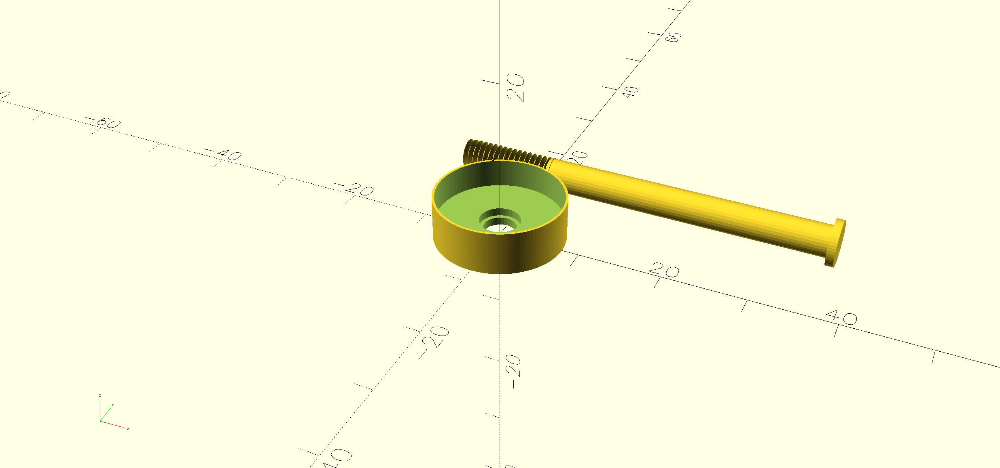
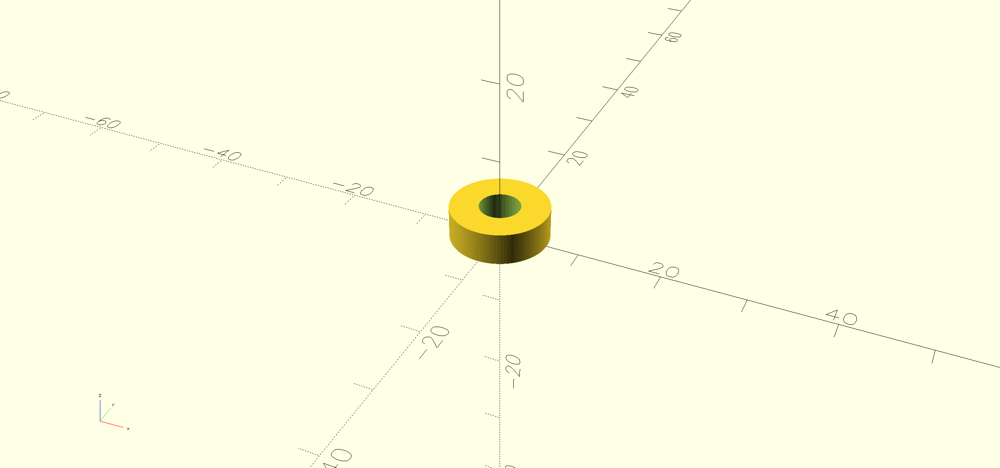

# bifold-control

This project provides a longer stem, with an M4 screw thread at one end and a collar with a slot for gluing the stem to it.

The bifold doors in my house had decorative handles that were falling off, and the screws being used were very short and hard to work with.

I ended up just using the button head screw with the old hardware, and creative use of different glues.

However, I left the sleeve, just in case it's needed for a different implementation.

Included in the code is a spacer that you can configure as needed.

