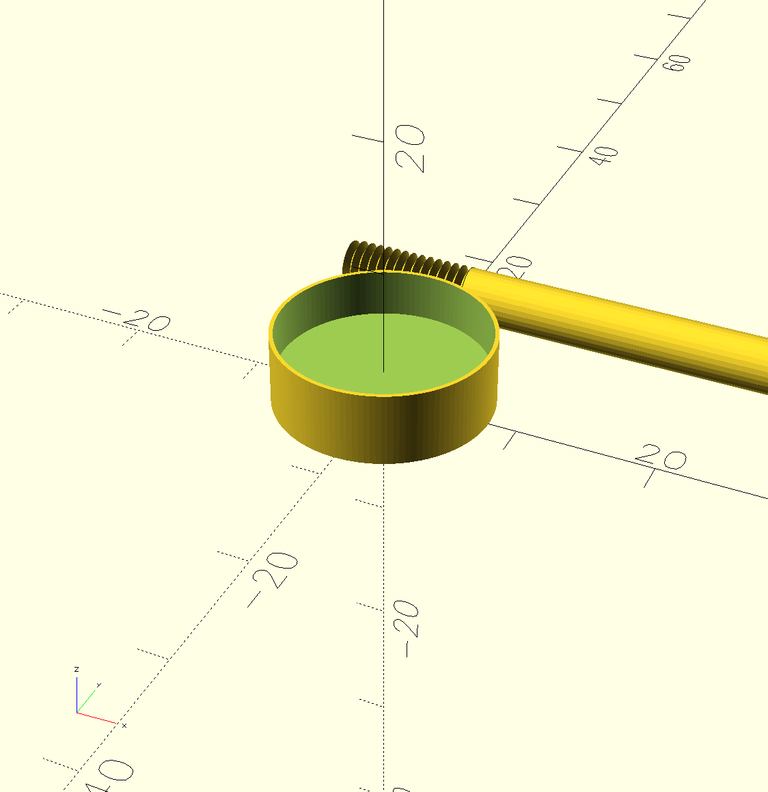

# bifold-control

This project provides a longer stem, with an M4 screw thread at one end and a collar with a slot for gluing the stem to it.

The bifold doors in my house had decorative handles that were falling off, and the screws being used were very short and hard to work with.

This allows me to fit the collar and glue it to the decorative handle and have a longer screw for easier management with the door.

