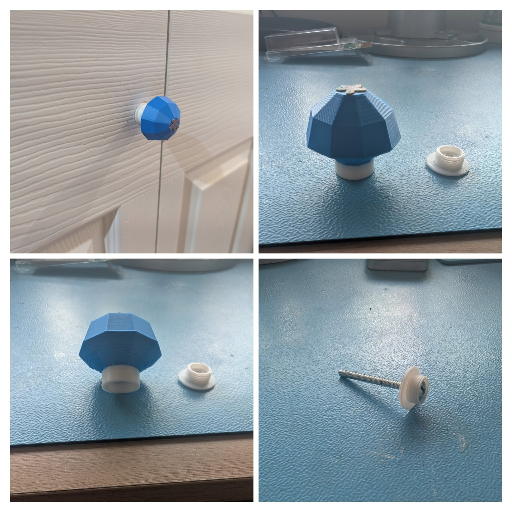

# bifold-control

This project provides a way to add custom door pulls to bifold doors

The bifold doors in my house had decorative handles that were falling off, and repairing the ones that were there turned out to be futile and I didn't like what was available to purchase

This project provides:

* A door fitment with opening to insert an M4-.70x45 bolt and secure with an M4 nut
* A doorknob 

I used a Snapmaker U1 to 3D Print. Filaments used:

* Comgrow Basic PLA - Blue
* Comgrow Shiny Silk PLA - Rainbow
* Snapmaker Snapspeed PLA - White

_